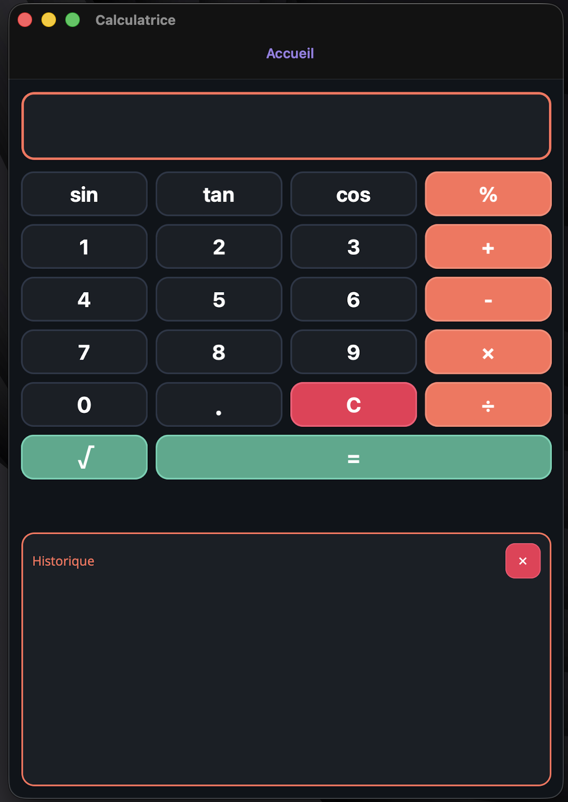

# Calculatrice MAUI

Une application calculatrice moderne et élégante développée avec **.NET MAUI**, offrant une interface utilisateur intuitive avec support complet des opérations mathématiques avancées.



## 🎯 Caractéristiques

### Opérations Basiques
- ➕ Addition
- ➖ Soustraction  
- ✖️ Multiplication
- ➗ Division

### Fonctions Avancées
- 📐 Trigonométrie (sin, tan, cos) - conversions automatiques degrés/radians
- √ Racine carrée
- % Pourcentage
- . Décimal avec support des opérateurs

### Fonctionnalités Spéciales
- ⛓️ **Chaînage d'opérateurs** : Support complet des calculs en chaîne (ex: 5+3×2=16)
- 📋 **Historique** : Suivi automatique de tous les calculs effectués
- 🗑️ **Effacement de l'historique** : Bouton dédié pour nettoyer l'historique
- 🔄 **Affichage en temps réel** : Visualisez votre calcul au fur et à mesure de sa saisie
- 🎨 **Design moderne** : Interface sombre élégante avec palette de couleurs harmonieuse

## 🛠️ Architecture Technique

### Framework & Plateforme
- **Framework** : .NET MAUI 10.0
- **Langage** : C# avec XAML
- **Plateforme cible** : macOS Catalyst, iOS, Android, Windows

### Composants Clés
- **Moteur de calcul** : Arithmétique en virgule flottante avec gestion d'état
- **Système d'affichage** : Contrôle Editor multi-lignes pour visualisation en temps réel
- **Historique** : ObservableCollection<string> avec liaison de données automatique

## 🎨 Design & Interface

### Palette de Couleurs
- **Fond principal** : `#0F1419` (Gris très foncé)
- **Boutons par défaut** : `#1A1F26` / Border `#2D3748`
- **Opérateurs** : `#FF6F59` Coral / Border `#FF8A75`
- **Égal** : `#43AA8B` Seagrass / Border `#5DD4B4`
- **Effacer** : `#EF3054` Watermelon / Border `#FF5577`

### Layout
- Grille 4 colonnes × 8 lignes
- Espacement optimisé : 10px colonnes × 10px lignes
- Boutons arrondis : CornerRadius 16px
- Historique expansible occupant l'espace restant

## 📋 Calcul et Logique

### États Gérés
- `nb1` : Premier nombre
- `nb2` : Deuxième nombre  
- `result` : Résultat des calculs intermédiaires
- `operation` : Opérateur actuel (+, -, ×, ÷)
- `justCalculated` : Flag pour gérer les calculs consécutifs
- `history` : ObservableCollection pour le suivi

### Algorithme de Chaînage
Lors de la saisie d'un nouvel opérateur :
1. Si une opération est en cours, calculez le résultat partiel
2. Stockez le résultat comme nouveau `nb1`
3. Préparez-vous pour le nouvel opérateur

Exemple : `5 + 3 × 2 =`
1. `5` → nb1
2. `+` stocké
3. `3` → nb2
4. `×` déclenche le calcul : 5+3=8, puis 8×2=16

## 🚀 Démarrage Rapide

### Prérequis
- .NET 10.0 SDK
- Xcode (pour la compilation macOS/iOS)
- Visual Studio Code avec extension MAUI

### Compilation & Exécution

#### macOS Catalyst
```bash
dotnet build -f net10.0-maccatalyst -c Debug
dotnet run -f net10.0-maccatalyst
```

#### iOS Simulator
```bash
dotnet build -f net10.0-ios -c Debug
dotnet run -f net10.0-ios
```

#### Android Emulator
```bash
dotnet build -f net10.0-android -c Debug
dotnet run -f net10.0-android
```

## 📁 Structure du Projet

```
MonAppMaui/
├── MainPage.xaml           # Interface utilisateur
├── MainPage.xaml.cs        # Logique métier et gestionnaires d'événements
├── App.xaml                # Configuration application
├── MauiProgram.cs          # Point d'entrée et configuration
├── MonAppMaui.csproj       # Définition du projet
├── Platforms/              # Code spécifique à chaque plateforme
└── Resources/              # Icônes, fonts, images
```

## 🔧 Modifications & Personnalisation

### Ajouter une Nouvelle Opération
1. Ajouter un bouton dans `MainPage.xaml`
2. Implémenter le gestionnaire clic dans `MainPage.xaml.cs`
3. Ajouter la logique dans `CalculateResult()`

### Modifier les Couleurs
Éditer les ResourceDictionary pour chaque Style dans `MainPage.xaml` :
```xaml
<Style x:Key="OperatorStyle" TargetType="Button">
    <Setter Property="BackgroundColor" Value="#FF6F59"/>
    <!-- Modifier #FF6F59 par votre couleur -->
</Style>
```

### Ajuster le Layout
Modifier les RowDefinitions/ColumnDefinitions dans la Grid principale pour changer les proportions.

## 🐛 Notes Techniques

### Gestion du Chaînage d'Opérateurs
Le chaînage est géré par le parsing de la chaîne d'affichage en utilisant `Split()` avec les symboles d'opérateurs en tant que séparateurs. Cela permet une flexibilité maximale dans les calculs consécutifs.

### Formatage des Nombres
Les nombres sont formatés via `FormatNumber()` utilisant le format "G10" pour un affichage propre sans chiffres inutiles.

### Trigonométrie
Les fonctions sin, tan, cos acceptent les entrées en degrés et les convertissent automatiquement en radians pour les calculs.

## 📝 Exemples d'Utilisation

| Opération | Résultat |
|-----------|----------|
| 5 + 3 = | 8 |
| 5 + 3 × 2 = | 16 |
| √16 = | 4 |
| sin(90) = | 1 |
| 50 % = | 0.5 |
| 10.5 + 5.25 = | 15.75 |
